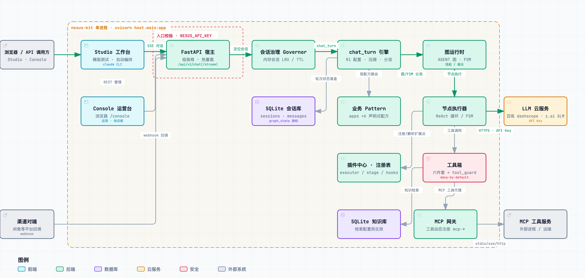

# nexus-kit

[](https://www.python.org/)
[](#)
[](https://fastapi.tiangolo.com/)
[](#它能做什么)
[](https://docs.astral.sh/uv/)

**nexus-kit** 是一个开源的大模型应用框架。它的信条是——**万物皆可流**：任何业务流程，不管是一个智能客服、一个研究报告生成器，还是一个预约下单系统，都能用这套框架拟合出来。拟合完之后，它就只剩两样东西：

- **一份数据**：这个应用有哪几步、每步说什么话、下一步跳到哪，全写在一份配置文件里。想改流程？改文件就行，不用动代码。
- **一堆插件**：模型怎么调、有哪些工具可用、知识库怎么查……每种能力都是一块积木，要用就插上，不用就拔掉。

同一套框架，对三类人都友好：

- 🤖 **Agent**（Claude Code 这类 AI 编程助手）：项目自带一份"说明书"技能，AI 看完就能摸清项目家底，还能直接动手生成新应用；
- 🧑‍💼 **不懂代码的人**：打开浏览器，填表单、改配置、发消息测试，全程不用写一行代码；
- 👨‍💻 **程序员**：用 Python 写新的积木和应用，放进去自动生效，还有测试帮你守住代码边界。

## 它能做什么？

**6 个装好就能玩的应用**

- **闲鱼卖家客服**（`xianyu_agent`）：替闲鱼卖家自动回买家消息——每条消息先判断来意（议价、问技术还是闲聊），再按卖家的规矩回话；议价能设轮数上限，回复自带违禁词过滤
- **店铺客服**（`customer_agent`）：电商店铺的售前售后客服，回答前先查商品和售后资料、不瞎编，还能推商品卡片；聊到超出范围的事，自动转人工
- **深度研究**（`deep_research_agent`）：给一个题目，先把大问题拆成几个小问题，多路同时去搜，查完还会反思要不要补搜，最后汇总成一份带引用来源的研究报告
- **主题研究**（`topic_research_agent`）：深度研究的加长版——拆主题、多路同时查、合并资料、写报告草稿、最后再润色一遍，一条流水线走完
- **安装预约**（`install_booking_agent`）：客服主动打电话给刚买了家具/电器的客户，约师傅上门安装——核对地址、确认到货、协商时间、确认改约一步不落；时间有严格把关，绝不会约出排班上不存在的档期
- **维修预约**（`repair_booking_agent`）：同款玩法的报修版——商品坏了主动联系客户约师傅上门维修；约完时间还会追问故障情况，好让师傅带对配件工具

**搭自己的应用**

- 两种玩法都支持：一种是"放手型"，AI 自己决定下一步干什么、调什么工具；另一种是"流程型"，按你定的步骤一步步走，该问什么就问什么
- 流程可以中途停下来等人（比如等人确认），人回复后接着往下走，服务重启了也不会丢
- 一个活儿能拆成几份同时干，干完自动合并——比如同时查 5 个子问题，总耗时只等最慢的那个
- 回复像打字机一样逐字输出；走到哪个节点、调了哪个工具，全程有记录可查

**工具和知识**

- 能接外部工具：支持 MCP 标准（业界通用的工具接口），配置几行就能接一个工具服务
- 自带一批趁手工具：执行命令、读写文件、任务清单、定时任务、派"子助手"分身干活、按固定套路跑流程
- 能装"技能"：把一份带手册的技能目录放进 skills/ 扫描根，节点声明 `use_skills` 即可按需装载——流程纪律写在 SKILL.md 里，改手册不用改代码（兼容 Claude Code 技能目录布局）
- 自带知识库：资料导进去，回答时先查资料再说话；查资料的策略也写在配置里，改完就生效
- 默认安全：工具不声明就不能用；危险操作（比如跑命令）执行前会先播报一声

**可视化界面**

- `/studio` 编排工作台：挑个应用发消息试试；或者用一句话描述需求，让 AI 帮你把新应用生成出来；也可以用表单或配置文件手动编排
- `/console` 运营台：查看每个应用长什么样、管理知识库、调整检索配置、审查会话记录（消息与过程轨迹合并时间线）
- 改配置、改流程基本不用重启，下一轮对话就生效

**接模型**

- 开箱支持阿里云百炼和 z.ai（GLM）；其他兼容 OpenAI 接口的服务，改个地址就能用
- 可以整体指定用哪个模型，也可以只给某个应用、甚至某个步骤单独换

## 系统架构

**运行时全景**——一次请求的完整旅程：浏览器 / 渠道回调 → FastAPI 宿主（入口校验·会话治理）→ chat_turn 引擎（配置·压缩·分流）→ 图运行时（AGENT / FSM）→ 节点执行器 → 工具箱 / MCP 网关 / LLM 云服务，落库走 SQLite 会话库与知识库：



> 🖱️ 交互式版本：[diagrams/runtime-architecture.html](diagrams/runtime-architecture.html) —— 可探索的独立 HTML 图（点选节点查看细节、明暗主题切换）。

**静态分层**——四层单向依赖：

```
host   (3)  组装根 ─ FastAPI 入口 / 配置装载 / 会话治理 / 热重载 / UI 宿主
 └─> apps  (2)  组合层 ─ 业务 pattern（6 个开箱应用）+ prompt 资产 + 渠道适配
      └─> atoms (1)  原子层 ─ executors / stages / tools / hooks / providers / knowledge / mcp
           └─> nexus (0)  内核 ─ context / model / pipeline / engine / registry / llm / settings
```

| 层 | 职责 | 核心特点 |
|---|---|---|
| **host** | 组装根 | ① FastAPI 服务 + SSE 流式端点（`/api/v1/chat/stream`）+ `/console` `/studio` 双 UI 挂载；② 配置装载、会话治理、四类热重载（配置 mtime 指纹缓存 / pattern·插件按依赖序重放重绑） |
| **apps** | 组合层 | ① 声明式业务配方：Pattern → Node 二层模型、YAML round-trip、注册期收集式校验；② 6 个开箱 pattern（客服 / 深度研究 / 主题研究 / 预约），自带 prompt 资产与渠道适配 |
| **atoms** | 原子积木 | ① 引擎扩展点统一经插件中心注册（executor / stage / messages_builder / agent_hooks），AST 自动发现；② 内置工具六件套 + MCP 网关（stdio / sse / streamable_http）+ SQLite 知识库，toolset 即授权单元 |
| **nexus** | 内核 | ① AGENT 图运行时（条件边路由 / `wait_human` 挂起恢复 / `sends` 扇出 map-reduce）+ FSM 双引擎，底层默认流式（LLMChunk → ChatStreamEvent → SSE）；② 零业务依赖——nexus 永不 import atoms，默认实现由 atoms 在 import 时反向注册进内核 |

依赖方向严格单向向下（host → apps → atoms → nexus），由 `tests/test_architecture.py` 在每次
pytest 时强制（import-linter 配置见 `pyproject.toml`，作为本地人工审计工具）。架构详情
（核心执行流 / 插件中心 / 声明式模型 / 流式协议 / 会话持久化 / 热重载）见
**[ARCHITECTURE.md](ARCHITECTURE.md)**。

## 快速开始

### 1. 克隆项目

```bash
git clone https://github.com/chengjian2018/nexus-kit.git
cd nexus-kit
```

### 2. 装环境

Python 3.11 及以上，推荐 [uv](https://docs.astral.sh/uv/)：

```bash
uv sync --extra dev     # 或者 pip install -e ".[dev]"
```

### 3. 配一个模型 Key

```bash
# 先复制一份本地配置（这个文件存密钥，已在 .gitignore 里，不会被传上 git）
cp host/config/local_config.example.yaml host/config/local_config.yaml

# 三选一：
# ① 用阿里云百炼（默认）
export DASHSCOPE_API_KEY=sk-...

# ② 用 z.ai（GLM）——还要把 local_config.yaml 里的 llm_default.code 改成 zai
export Z_AI_API_KEY=...

# ③ 接自己的模型：
#    兼容 OpenAI 接口的服务 —— 在 llm_providers 里加一节、改个地址就行；
#    完全自定义 —— 照着 atoms/providers/dashscope_provider.py 写一个，放进去自动生效。
```

配置模板原样不动，加上一个 Key 就能跑。接外部工具、知识库、各种上限怎么调，
配置文件里每一节都有注释；全部配置项见 `nexus/settings.py`。

### 4. 启动服务

```bash
uvicorn host.main:app --port 8000
```

想先跑一遍测试也行（不用联网，模型是假的）：

```bash
python -m pytest        # uv 环境：uv run python -m pytest
```

### 5. 打开浏览器玩

- **编排工作台** <http://localhost:8000/studio/> —— 默认停在「模版测试」页签：挑个应用、
  发条消息就能聊，回复逐字输出，每一步的过程都能展开看。「自动编排」页签能用一句话需求
  生成新应用（需要本机装了 claude 命令行）；「流程编排」页签能用表单和配置文件手动改、校验、发布。
- **运营配置台** <http://localhost:8000/console/> —— 看应用结构、管知识库、调检索配置；
  「会话审查」页能按 pattern / session_id 过滤历史会话，进详情看消息与节点·工具轨迹的
  合并时间线（异常轮次、工具幻觉拦截等会红边高亮）。
  （如果设置了 `NEXUS_API_KEY`，在页面右上角填同一个。）

## Author

[chengjian2018](https://github.com/chengjian2018)
