# Pattern: 安装预约外呼助手（手绘FSM转写） (`install_booking_agent`)

> 对话管理：FSM 统一阶段推进安装预约外呼——核对地址、确认到货、协商师傅上门时间（可约守卫 + 档期推荐/具体日期/最近三路）、最终确认与改约；通用拒绝与下次联系时间补充通道；相对时间先经时间增强改写为绝对时间

- 入口模块: `install_booking`
- 模块数: 1　节点数: 15

## 结构图

```mermaid
flowchart TB
    START(("⏵ 开始"))
    subgraph m_install_booking ["install_booking · 安装预约外呼 (FSM)"]
        n_install_greet["install_greet<br/>外呼开场<br/>slots: service_needed"]
        n_install_confirm_addr["install_confirm_addr<br/>地址核对<br/>slots: address_confirmed, address"]
        n_install_check_arrival["install_check_arrival<br/>到货确认<br/>slots: arrived"]
        n_install_ask_eta["install_ask_eta<br/>到货时间询问<br/>slots: eta_known, eta"]
        n_install_time_window["install_time_window<br/>时间段询问<br/>slots: time_window"]
        n_install_available["install_available<br/>上门方便确认<br/>slots: available"]
        n_install_ask_time["install_ask_time<br/>上门时间协商<br/>slots: visit_time"]
        n_install_recommend["install_recommend<br/>档期推荐<br/>slots: recommended_slots, chosen_slot"]
        n_install_specific_date["install_specific_date<br/>具体日期约定<br/>slots: visit_date, visit_hour"]
        n_install_nearest["install_nearest<br/>最近档期安排<br/>slots: visit_time"]
        n_install_confirm_time["install_confirm_time<br/>上门时间确认<br/>slots: visit_time, address"]
        n_install_reschedule["install_reschedule<br/>改约重协商<br/>slots: rescheduled, prev_visit_time"]
        n_install_ask_callback["install_ask_callback<br/>下次联系时间<br/>slots: callback_time"]
        n_install_decline["install_decline<br/>通用拒绝承接<br/>slots: decline_reason"]
        n_install_end["install_end<br/>通话结束语 · 终态"]
        n_install_greet --> n_install_confirm_addr
        n_install_greet --> n_install_end
        n_install_greet --> n_install_decline
        n_install_confirm_addr --> n_install_check_arrival
        n_install_confirm_addr --> n_install_end
        n_install_confirm_addr --> n_install_decline
        n_install_check_arrival --> n_install_ask_time
        n_install_check_arrival --> n_install_ask_eta
        n_install_check_arrival --> n_install_decline
        n_install_ask_eta --> n_install_time_window
        n_install_ask_eta --> n_install_available
        n_install_ask_eta --> n_install_decline
        n_install_time_window --> n_install_ask_time
        n_install_time_window --> n_install_available
        n_install_time_window --> n_install_decline
        n_install_available --> n_install_ask_time
        n_install_available --> n_install_ask_callback
        n_install_available --> n_install_decline
        n_install_ask_time --> n_install_recommend
        n_install_ask_time --> n_install_specific_date
        n_install_ask_time --> n_install_nearest
        n_install_ask_time --> n_install_decline
        n_install_recommend --> n_install_specific_date
        n_install_recommend --> n_install_nearest
        n_install_recommend --> n_install_ask_time
        n_install_recommend --> n_install_decline
        n_install_specific_date --> n_install_confirm_time
        n_install_specific_date --> n_install_ask_time
        n_install_specific_date --> n_install_decline
        n_install_nearest --> n_install_confirm_time
        n_install_nearest --> n_install_ask_time
        n_install_nearest --> n_install_decline
        n_install_confirm_time --> n_install_end
        n_install_confirm_time --> n_install_reschedule
        n_install_confirm_time --> n_install_decline
        n_install_reschedule --> n_install_ask_time
        n_install_reschedule --> n_install_decline
        n_install_ask_callback --> n_install_end
        n_install_ask_callback --> n_install_decline
        n_install_decline --> n_install_end
    end
    START --> n_install_greet
    classDef nodeEnd fill:#f5f3ff,stroke:#7c3aed,stroke-width:2px
    classDef nodeAgent fill:#ecfdf5,stroke:#059669,stroke-width:2px
    class n_install_end nodeEnd
    style START fill:#fffbeb,stroke:#d97706,stroke-width:2px
    style m_install_booking fill:#f0fdf4,stroke:#16a34a,stroke-width:3px
```

## 图例

- **subgraph** = 模块（蓝 ROUTE / 绿 FSM / 橙 AGENT，入口模块边框加粗）
- **实线箭头** = 节点跳转（`sub_nodes`）
- **虚线箭头 jump_module** = 菜单节点跨模块分发（指向目标模块首节点）
- **虚线箭头 重置回根** = ROUTE 菜单节点未声明 jump_module，回到路由根节点
- **⏵ 开始** = 会话入口（入口模块首节点）
- **终态** = `is_end` 节点

## 模块与节点详情

### install_booking · 安装预约外呼（FSM）

手绘FSM模板转写（外呼语义）：家具/电器购买客户回访——外呼开场→地址核对→到货确认→上门时间协商（推荐/具体日期/最近三路，可约守卫校验）→时间确认（支持改约）→通话结束；附通用拒绝承接与下次联系时间两条补充通道

| 节点 | 名称 | 描述 | 槽位 | 后继 | 跳转模块 | 终态 |
| --- | --- | --- | --- | --- | --- | --- |
| install_greet | 外呼开场 | 电话接通后的开场：自报家门（品牌售后客服）、说明来意（客户购买的商品需要上门安装）、确认客户方便接听 | service_needed | install_confirm_addr, install_end, install_decline | - |  |
| install_confirm_addr | 地址核对 | 复述订单收货地址，请客户核对是否一致（师傅按此地址上门） | address_confirmed, address | install_check_arrival, install_end, install_decline | - |  |
| install_check_arrival | 到货确认 | 确认商品是否已经送达客户地址（师傅需货到后才能上门安装） | arrived | install_ask_time, install_ask_eta, install_decline | - |  |
| install_ask_eta | 到货时间询问 | 未到货时询问客户是否知道大概的到货时间 | eta_known, eta | install_time_window, install_available, install_decline | - |  |
| install_time_window | 时间段询问 | 客户知道到货时间后，请客户讲一个方便接收/安装的时间段 | time_window | install_ask_time, install_available, install_decline | - |  |
| install_available | 上门方便确认 | 确认客户近期是否方便安排师傅上门安装 | available | install_ask_time, install_ask_callback, install_decline | - |  |
| install_ask_time | 上门时间协商 | 核心调度节点：询问客户希望师傅什么时间上门；说不出具体时间则主动推荐档期，给出具体日期则记录，要最近的则走最近档期 | visit_time | install_recommend, install_specific_date, install_nearest, install_decline | - |  |
| install_recommend | 档期推荐 | 客户说不出时间或所给时间不可约时，按师傅排班（任务信息的available_slots）主动推荐可约档期，客户选定后进入对应节点 | recommended_slots, chosen_slot | install_specific_date, install_nearest, install_ask_time, install_decline | - |  |
| install_specific_date | 具体日期约定 | 客户给出具体日期/时间，复述确认并锁定师傅上门时间；所给时间是否可约由统一阶段后的可约守卫校验（不可约会被改道到档期推荐） | visit_date, visit_hour | install_confirm_time, install_ask_time, install_decline | - |  |
| install_nearest | 最近档期安排 | 客户要最近的上门时间，按最近可约档期复述确认 | visit_time | install_confirm_time, install_ask_time, install_decline | - |  |
| install_confirm_time | 上门时间确认 | 最终确认节点：复述锁定的上门时间与地址，确认无误后收尾；客户此时改约则转入改约节点重新协商 | visit_time, address | install_end, install_reschedule, install_decline | - |  |
| install_reschedule | 改约重协商 | 客户在时间确认后要求改期：致歉并作废原时间，重新进入上门时间协商（新时间会重新过可约守卫） | rescheduled, prev_visit_time | install_ask_time, install_decline | - |  |
| install_ask_callback | 下次联系时间 | 客户现在没空或暂时不想预约时，询问并记录下次来电时间，约好后礼貌收尾（这是联系时间，不是上门时间，不进可约守卫） | callback_time | install_end, install_decline | - |  |
| install_decline | 通用拒绝承接 | 通用退出通道：客户不想预约/已安装过/商品有质量问题/已退货/非本人等意图，按场景共情回应，然后转入通话结束 | decline_reason | install_end | - |  |
| install_end | 通话结束语 | 通话收尾：预约完成、约好下次联系、客户拒绝、地址不符等所有终止路径的礼貌收尾（is_end 终节点，进入即结束会话） | - | - | - | ✓ |

**回答示例**

- `install_greet`: 您好，请问是{user_name}先生/女士吗？我是{product_name}品牌售后客服，您购买的商品可以安排师傅上门安装，现在方便聊两句吗？
- `install_greet`: 您好打扰了，这里是{product_name}售后服务中心，给您来电是想帮您预约上门安装，您这边方便吗？
- `install_confirm_addr`: 先跟您核对一下地址：师傅上门是到{address}，对吗？
- `install_confirm_addr`: 麻烦确认下，安装地址是{address}这一处吧？
- `install_check_arrival`: 好的～请问您的{product_name}现在已经送到{address}了吗？
- `install_check_arrival`: 商品这边显示近期送达，您那边签收了吗？
- `install_ask_eta`: 还没到也没关系～您知道大概什么时候能送到吗？
- `install_ask_eta`: 您那边有物流的预计送达时间吗？跟我说说就好。
- `install_time_window`: 那您哪个时间段在家方便？我好帮您约师傅～
- `install_time_window`: 您说个大概的时间段（比如周末白天），我来协调师傅上门。
- `install_available`: 了解～那最近方便安排师傅上门安装吗？
- `install_available`: 您这边近期方便约个时间安装吗？
- `install_ask_time`: 请问您希望师傅什么时间上门呢？方便给个大概日期或时间段吗？
- `install_ask_time`: 您哪天在家方便？我可以帮您查最近的安装档期～
- `install_recommend`: 要不这样，最近可以约明天上午10点或后天下午2-4点，您看哪个合适？
- `install_recommend`: 我这边推荐周末上午的档口，师傅上门安装也从容些，您觉得呢？
- `install_specific_date`: 好的，那就给您约在{visit_date}{visit_hour}，师傅到时会提前联系您～
- `install_specific_date`: 收到～{visit_date}这个时间可以安排，我帮您登记上了。
- `install_nearest`: 最快可以安排最近的档期上门，时间临近师傅会提前联系您～
- `install_nearest`: 帮您插了最近的安装档期，您留意下师傅的电话哦。
- `install_confirm_time`: 跟您最后确认下：{visit_time}师傅到{address}上门安装，没问题吧？
- `install_confirm_time`: 那就定啦——{visit_time}上门，地址{address}，辛苦您届时在家等一下～
- `install_reschedule`: 没问题，改期很方便～那我们重新约一下，您什么时间方便？
- `install_reschedule`: 好的好的，原来的时间帮您取消，您看约到什么时候合适？
- `install_ask_callback`: 理解理解～那您看我们什么时候再联系您方便？我记一下时间。
- `install_ask_callback`: 好的，那不打扰了，您方便的时候我们什么时候再打给您？
- `install_decline`: 好的，那就不安排上门安装了～有需要您随时联系我们，感谢接听。
- `install_decline`: 了解，既然已经安装好了就不打扰了，祝您使用愉快～
- `install_decline`: 非常抱歉给您带来困扰，质量问题我这边帮您记录反馈，稍后会有专人联系您处理，请您留意来电。
- `install_decline`: 好的，退货的话安装预约就帮您取消了，祝您生活愉快。
- `install_decline`: 不好意思打扰了，那我跟{user_name}先生/女士再确认时间，感谢您的接听。
- `install_end`: 好的，那就不打扰您了～稍后有需要随时来电，祝您生活愉快，再见～
- `install_end`: 感谢您的接听与配合，那我们{visit_time}见，祝您使用愉快，再见～
- `install_end`: 好的，地址问题建议您联系卖家或平台核实哦，感谢接听，再见～

