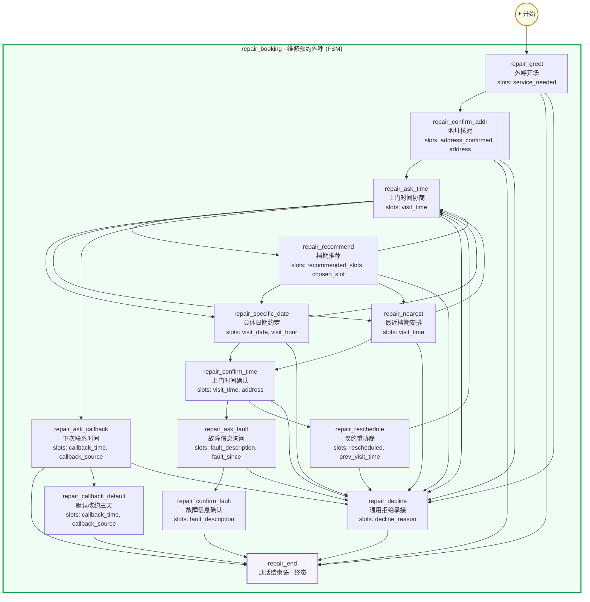

# Pattern: 维修预约外呼助手（安装场景变体） (`repair_booking_agent`)

> 对话管理：FSM 统一阶段推进维修预约外呼——核对地址、协商师傅上门时间（可约守卫 + 档期推荐/具体日期/最近三路）、最终确认与改约、确认后继续采集商品故障信息再挂机；通用拒绝与下次联系时间补充通道；相对时间先经时间增强改写为绝对时间

- 入口模块: `repair_booking`
- 模块数: 1　节点数: 14

## 结构图

## 图例

- **subgraph** = 模块（蓝 ROUTE / 绿 FSM / 橙 AGENT，入口模块边框加粗）
- **实线箭头** = 节点跳转（`sub_nodes`）
- **虚线箭头 jump_module** = 菜单节点跨模块分发（指向目标模块首节点）
- **虚线箭头 重置回根** = ROUTE 菜单节点未声明 jump_module，回到路由根节点
- **⏵ 开始** = 会话入口（入口模块首节点）
- **终态** = `is_end` 节点

## 模块与节点详情

### repair_booking · 维修预约外呼（FSM）

安装预约外呼的维修变体：家具/电器报修客户外呼——外呼开场→地址核对→上门时间协商（推荐/具体日期/最近三路，可约守卫校验）→时间确认（支持改约）→故障信息采集与确认→通话结束；无到货环节，通用拒绝承接与下次联系时间两条补充通道

| 节点 | 名称 | 描述 | 槽位 | 后继 | 跳转模块 | 终态 |
| --- | --- | --- | --- | --- | --- | --- |
| repair_greet | 外呼开场 | 电话接通后的开场：自报家门（品牌售后客服）、说明来意（客户报修的商品需要安排师傅上门维修）、确认客户方便接听 | service_needed | repair_confirm_addr, repair_end, repair_decline | - |  |
| repair_confirm_addr | 地址核对 | 复述订单地址，请客户核对是否一致（师傅按此地址上门） | address_confirmed, address | repair_ask_time, repair_end, repair_decline | - |  |
| repair_ask_time | 上门时间协商 | 核心调度节点：询问客户希望师傅什么时间上门维修；说不出具体时间则主动推荐档期，给出具体日期则记录，要最近的则走最近档期；现在没空暂时不想约则转下次联系时间 | visit_time | repair_recommend, repair_specific_date, repair_nearest, repair_ask_callback, repair_decline | - |  |
| repair_recommend | 档期推荐 | 客户说不出时间或所给时间不可约时，按师傅排班（任务信息的available_slots）主动推荐可约档期，客户选定后进入对应节点 | recommended_slots, chosen_slot | repair_specific_date, repair_nearest, repair_ask_time, repair_decline | - |  |
| repair_specific_date | 具体日期约定 | 客户给出具体日期/时间，复述确认并锁定师傅上门时间；所给时间是否可约由统一阶段后的可约守卫校验（不可约会被改道到档期推荐） | visit_date, visit_hour | repair_confirm_time, repair_ask_time, repair_decline | - |  |
| repair_nearest | 最近档期安排 | 客户要最近的上门时间，按最近可约档期复述确认 | visit_time | repair_confirm_time, repair_ask_time, repair_decline | - |  |
| repair_confirm_time | 上门时间确认 | 最终确认节点：复述锁定的上门时间与地址；确认无误后不是收尾——维修场景还需继续采集故障信息（师傅要带对配件工具）；客户此时改约则转入改约节点重新协商 | visit_time, address | repair_ask_fault, repair_reschedule, repair_decline | - |  |
| repair_reschedule | 改约重协商 | 客户在时间确认后要求改期：致歉并作废原时间，重新进入上门时间协商（新时间会重新过可约守卫） | rescheduled, prev_visit_time | repair_ask_time, repair_decline | - |  |
| repair_ask_fault | 故障信息询问 | 维修场景的收尾前置环节：上门时间确认后，询问客户商品的具体故障情况（不制冷/异响/门关不严/部件损坏等），师傅按此带对配件工具；客户说不清时留在本节点继续引导描述现象 | fault_description, fault_since | repair_confirm_fault, repair_decline | - |  |
| repair_confirm_fault | 故障信息确认 | 复述采集到的故障要点请客户确认（保证报修口径准确），确认后进入通话结束——获得故障信息后才挂机（两拍收尾，与通用拒绝承接同构） | fault_description | repair_end | - |  |
| repair_ask_callback | 下次联系时间 | 客户现在没空或暂时不想预约时，询问并记录下次来电时间（这是联系时间，不是上门时间，不进可约守卫）。答复三分支由统一阶段的确定性守卫裁定：时间合适（未来两周内）→直接进通话结束播报客户时间；太远（超过两周）/过去/未给出→改走「默认改约三天」节点 | callback_time, callback_source | repair_end, repair_callback_default, repair_decline | - |  |
| repair_callback_default | 默认改约三天 | 客户给的下次联系时间太远（超过两周）、已是过去时间、或说都行/未给出时间时，改约默认 3 天后再联系：播报默认联系时间并征询客户意见，客户应答后进入通话结束（两拍收尾；分支裁定与默认时间由统一阶段的确定性守卫给出） | callback_time, callback_source | repair_end | - |  |
| repair_decline | 通用拒绝承接 | 通用退出通道：客户不想维修/已自行修好/已找别人修过/非本人等意图，按场景共情回应，然后转入通话结束（维修场景没有质量问题/退货出口——质量诉求就是维修诉求本身） | decline_reason | repair_end | - |  |
| repair_end | 通话结束语 | 通话收尾：预约完成且故障信息已采集、约好下次联系、客户拒绝、地址不符等所有终止路径的礼貌收尾（is_end 终节点，进入即结束会话） | - | - | - | ✓ |

**回答示例**

- `repair_greet`: 您好，请问是{user_name}先生/女士吗？我是{product_name}品牌售后客服，看到您的报修记录，给您安排师傅上门维修，现在方便聊两句吗？
- `repair_greet`: 您好打扰了，这里是{product_name}售后服务中心，给您来电是想帮您约师傅上门检修，您这边方便吗？
- `repair_confirm_addr`: 先跟您核对一下地址：师傅上门是到{address}，对吗？
- `repair_confirm_addr`: 麻烦确认下，维修地址是{address}这一处吧？
- `repair_ask_time`: 请问您希望师傅什么时间上门维修呢？方便给个大概日期或时间段吗？
- `repair_ask_time`: 您哪天在家方便？我可以帮您查最近的维修档期～
- `repair_recommend`: 要不这样，最近可以约明天上午10点或后天下午2-4点，您看哪个合适？
- `repair_recommend`: 我这边推荐周末上午的档口，师傅上门检修也从容些，您觉得呢？
- `repair_specific_date`: 好的，那就给您约在{visit_date}{visit_hour}，师傅到时会提前联系您～
- `repair_specific_date`: 收到～{visit_date}这个时间可以安排，我帮您登记上了。
- `repair_nearest`: 最快可以安排最近的档期上门检修，时间临近师傅会提前联系您～
- `repair_nearest`: 帮您插了最近的维修档期，您留意下师傅的电话哦。
- `repair_confirm_time`: 跟您最后确认下：{visit_time}师傅到{address}上门维修，没问题吧？
- `repair_confirm_time`: 那就定啦——{visit_time}上门，地址{address}，辛苦您届时在家等一下～
- `repair_reschedule`: 没问题，改期很方便～那我们重新约一下，您什么时间方便？
- `repair_reschedule`: 好的好的，原来的时间帮您取消，您看约到什么时候合适？
- `repair_ask_fault`: 好的～那顺便跟您确认下，您的{product_name}具体是什么问题呢？比如哪里响、不制冷还是门关不严？
- `repair_ask_fault`: 为了师傅上门带对配件，您跟我说说{product_name}的故障现象呗～
- `repair_confirm_fault`: 好的，您的{product_name}是{fault_description}对吧，我记录好了，师傅上门会带好相应配件工具～
- `repair_confirm_fault`: 明白啦，{fault_description}这个情况我帮您登记了，师傅会提前准备，您放心～
- `repair_ask_callback`: 理解理解～那您看我们什么时候再联系您方便？我记一下时间。
- `repair_ask_callback`: 好的，那不打扰了，您方便的时候我们什么时候再打给您？
- `repair_callback_default`: 那我们先约 3 天后左右再给您来电话确认，您看可以吗？
- `repair_callback_default`: 您说的这个时间有点远呢，我们先 3 天后再联系您方便吗？
- `repair_decline`: 好的，那就不安排上门维修了～有需要您随时联系我们，感谢接听。
- `repair_decline`: 了解，您自己已经修好了就不打扰了，祝您使用愉快～
- `repair_decline`: 好的，您已经安排了别的师傅，我们这边就不重复上门了，祝您生活愉快。
- `repair_decline`: 不好意思打扰了，那我跟{user_name}先生/女士再确认时间，感谢您的接听。
- `repair_end`: 好的，那就不打扰您了～稍后有需要随时来电，祝您生活愉快，再见～
- `repair_end`: 感谢您的接听与配合，那我们{visit_time}见，师傅会带好配件，祝您使用愉快，再见～
- `repair_end`: 好的，地址问题建议您联系卖家或平台核实哦，感谢接听，再见～

